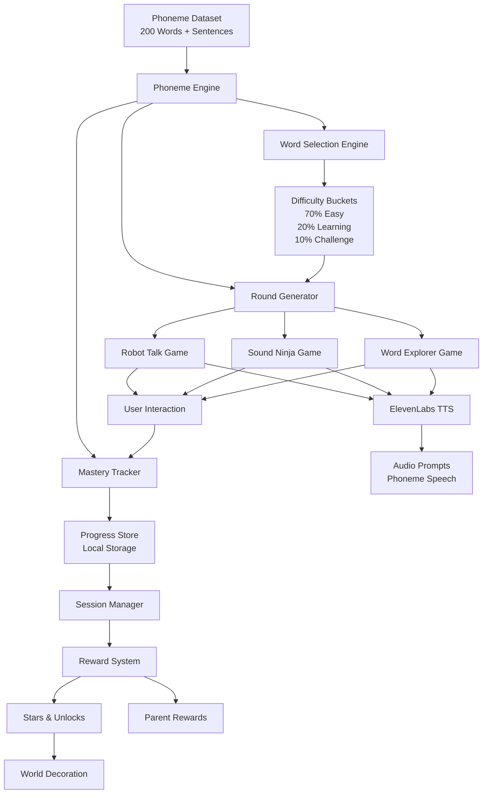

Below is a **developer-friendly architecture diagram and description** for the Zoe’s World phoneme engine and game pipeline. It’s written in **Markdown with a Mermaid diagram**, so your team can drop it directly into the repo (e.g. `projects/phoneme_engine_architecture.md`) and it will render nicely in GitHub, GitLab, or many documentation tools.

---

# Zoe’s World – Phoneme Engine Architecture

## Overview

The Zoe’s World learning system is built around a **central phoneme engine** that powers all learning games using a shared phoneme dataset.

This architecture ensures:

* consistent phonics modelling
* minimal duplication across games
* controlled learning progression
* predictable session flow

The system transforms **dataset → phoneme prompts → game rounds → progress tracking → rewards**.

---

# System Architecture



---

# Core Components

## 1. Phoneme Dataset

Location:

```id="2p1jso"
projects/zoes_world_phoneme_dataset_200.json
```

Contains structured phoneme entries across five stages.

Responsibilities:

* provide phoneme tokens
* define difficulty stage
* ensure correct phonics modelling

Example entry:

```json
{
  "word": "ship",
  "phonemes": ["sh","i","p"],
  "stage": 2
}
```

---

# 2. Phoneme Engine

Central logic layer responsible for generating all game rounds.

Responsibilities:

* word selection
* phoneme segmentation
* game prompt generation
* mastery tracking
* difficulty adaptation

Location suggestion:

```id="dlp2el"
/utils/phonemeEngine.ts
```

Core functions:

```
pickWord()
generateRobotTalkRound()
generateSoundNinjaRound()
generateWordExplorerRound()
updateMastery()
shouldAdvanceStage()
```

---

# 3. Word Selection Engine

Selects words based on success probability.

Distribution:

```id="38r6a6"
70% familiar words
20% learning words
10% challenge words
```

Purpose:

Maintain confidence while introducing gradual challenge.

---

# 4. Game Round Generator

Creates playable rounds for each mini-game.

Supported games:

```
Robot Talk
Sound Ninja
Word Explorer
```

Each round includes:

```
prompt
correctAnswer
distractors
phonemes
stage
```

---

# 5. ElevenLabs Text-to-Speech Layer

Zoe’s World uses **ElevenLabs** to produce clear phoneme prompts.

This improves phoneme clarity significantly compared to browser TTS.

Example phoneme prompt:

```id="fjx32y"
sh... i... p
```

Implementation concept:

```
phonemes.join(" ... ")
```

Design requirements:

* slow pacing
* slight pauses between sounds
* warm child-friendly voice

---

# 6. Game Interaction Layer

Handles user interaction.

Responsibilities:

* display phoneme prompts
* handle tap interactions
* trigger feedback
* send results to mastery tracker

Games:

### Robot Talk

Blending phonemes into words.

### Sound Ninja

Deleting phonemes.

### Word Explorer

Building words from phoneme tiles.

---

# 7. Mastery Tracker

Tracks performance for each word.

Data stored locally.

Example structure:

```json
{
  "ship": {
    "attempts": 4,
    "correct": 3,
    "streak": 2,
    "status": "Practiced"
  }
}
```

Mastery levels:

```
New
Learning
Practiced
Mastered
```

Rules:

```
3 correct → Practiced
5 correct → Mastered
```

---

# 8. Session Manager

Controls the daily play loop.

Typical session:

```
enter world
play 3 games
earn stars
decorate world
end session
```

Session length target:

```
5–8 minutes
```

---

# 9. Reward System

Reinforces engagement.

Rules:

```
1 game = 1 star
3 stars = decoration unlock
10 stars = animal unlock
```

Parent reward:

```
5 sessions completed
```

---

# 10. World Layer

Visual world that evolves with progress.

Examples:

* treehouse upgrades
* animals unlocked
* flowers planted

Purpose:

Make learning progress **visibly meaningful**.

---

# Data Flow Summary

Learning flow:

```id="g5n0lq"
Dataset
↓
Phoneme Engine
↓
Game Round
↓
ElevenLabs Speech
↓
Child Interaction
↓
Mastery Update
↓
Rewards
```

---

# Design Principles

The architecture prioritizes:

### Confidence

High success probability.

---

### Calm Interaction

No timers or pressure.

---

### Consistency

Same phoneme logic across games.

---

### Adaptation

Difficulty increases gradually.

---

# Why This Architecture Works

This design keeps the learning system:

**simple for developers**

* one engine
* one dataset
* multiple games

**powerful for learning**

* consistent phoneme modelling
* controlled progression
* reward-driven engagement

---

# Expected Outcome

With consistent use the system should:

* improve phoneme awareness
* increase reading confidence
* reinforce blending and decoding skills

Most importantly:

Zoe should **want to play**.

---

If you'd like, I can also produce a **very useful follow-up for your developers**:

* a **full React folder architecture**
* the **phoneme engine TypeScript skeleton**
* a **distractor generation algorithm**

That would let Claude Code generate **working code much faster and more reliably.**
